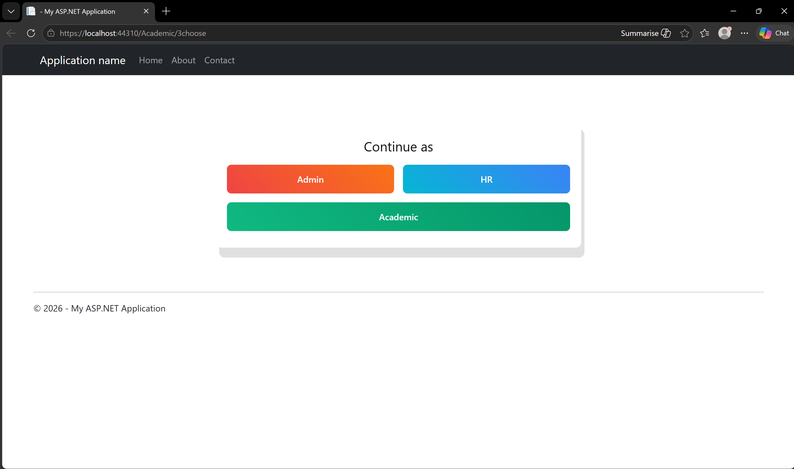

# University HR Management System

Full-stack University HR Management System built with **ASP.NET Web Forms (C#)** and **SQL Server**.
The system manages university HR operations including employee data, attendance, leave workflows, and payroll generation through multiple role-based portals.

> German University in Cairo — Database Course Project

---

## 🚀 Tech Stack

* **Frontend:** ASP.NET Web Forms, Bootstrap, jQuery
* **Backend:** C#, .NET Framework
* **Database:** SQL Server (LocalDB)
* **Data Access:** Entity Framework + ADO.NET

---

## ✨ Key Features

* Multi-role system: **Admin, Academic, HR**
* Role-based **leave approval workflow**
* Employee attendance tracking system
* Monthly payroll generation with deductions
* Performance evaluation system
* 30+ stored procedures implementing business logic

---

## 🧩 Modules

### Admin

* Manage employees and departments
* Control attendance and holidays
* Update employee status
* Handle deductions and replacements

### Academic

* Apply for different leave types
* View attendance and payroll
* Track leave status
* Access performance evaluations

### HR

* Approve/reject leave requests
* Add deductions
* Generate payroll

---

## 🗄️ Database

* Designed with **10+ entities**
* Implements **30+ stored procedures, views, and functions**
* Includes **role hierarchy system**
* Core business logic handled at database level

---

## 📸 Screenshots

### 🔹 My Work (Admin)

  
  

### 🔹 System Overview

  

## 👥 My Contribution

This project was developed as part of a **5-member team**.

My primary contributions:

* Implemented the **Admin Login system**
* Designed and developed the **Admin Dashboard (Admin Panel)**
* Developed backend logic for admin functionalities using **C# and ADO.NET / Entity Framework**
* Integrated frontend with **SQL Server database operations**
* Contributed to handling **data retrieval, validation, and database interaction**

Other modules (HR, Academic, and additional features) were developed collaboratively by the team.

---

## ▶️ How to Run

1. Open the project in **Visual Studio**
2. Open **SQL Server Management Studio**
3. Run the following files in order:

   * `Final (1).sql`
   * `Insertions -MS3.sql`
4. Ensure the connection string in `Web.config` matches your SQL Server instance
5. Run the project from Visual Studio

---

## 📝 Notes

* Runs locally using Visual Studio + SQL Server
* Designed as an academic project for demonstration purposes
* Role-based access affects system behavior

---

## 👤 Author

**Seif Aboelenain**
3rd Year Computer Engineering Student
German University in Cairo
